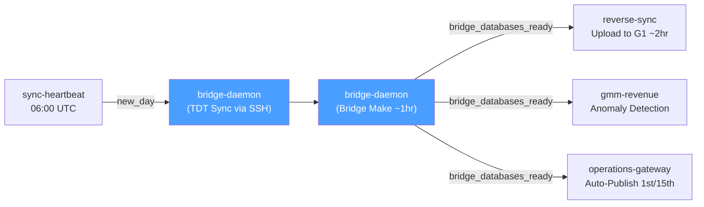
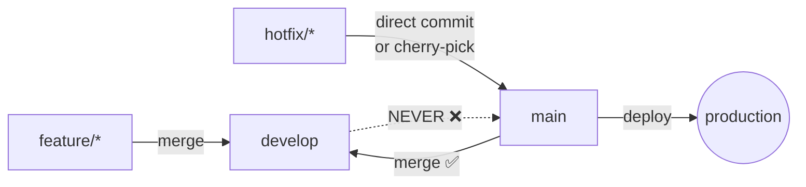
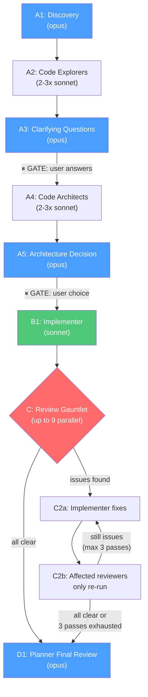
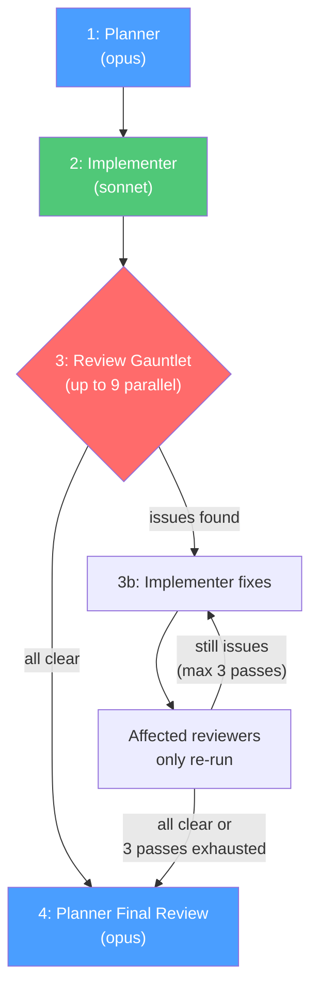
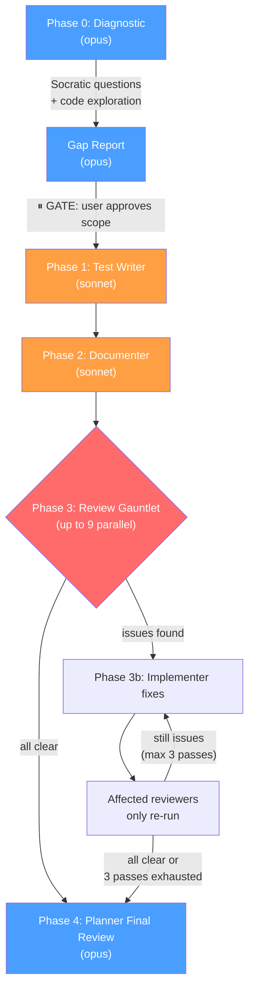

# GMM Docker Swarm Migration - Claude Reference

**→ [`AAA_MASTER_PLAN.md`](AAA_MASTER_PLAN.md)** — master plan, current tasks, all documentation

## Contents

- [Session Start](#-session-start)
- [Production Swarm Host](#-production-swarm-host)
- [Production Safety Guardrails](#-production-safety-guardrails)
- [Pipeline Architecture](#-pipeline-architecture)
- [Git Workflow](#-git-workflow)
- [Service Definition Triplication](#-service-definition-triplication)
- [Test-First Development](#-test-first-development)
- [Agent Teams](#-agent-teams-for-implementations)
- [Quality Checker Tools](#quality-checker-tools-by-language)
- [Build Verification Rule](#build-verification-rule)
- [Lefthook (Pre-commit Hooks)](#lefthook-pre-commit-hooks)
- [Install Tools](#install-tools)

---

## 🚀 **SESSION START**

**Always display this block at the start of every new session:**

> **Available Teams:**
>
> | Command | What it does |
> |---------|-------------|
> | `"Full team"` | Discovery → Architecture → Implementation → Review (new features, unclear requirements) |
> | `"Impl team"` / `"Small team"` | Plan → Implement → Review (well-defined tasks, bug fixes) |
> | `"Team only review"` | Diagnostic → Tests → Docs → Review Gauntlet (reviewing existing code safely) |
> | `"Team only quality"` | Quality Checker only (lint/format on existing code) |
> | `"Team only plan"` | Planner analysis only (no implementation) |
> | `"Skip the team"` / `"Just do it"` | Bypass teams, act directly |
>
> **What's guaranteed before any review touches the code:**
>
> | Scenario | Team | Safety guarantee |
> |----------|------|-----------------|
> | Building something new | Full Team | Requirements discovered → tests written first → then review |
> | Well-defined task | Impl Team | Acceptance criteria defined → tests written first → then review |
> | Reviewing existing code | Review-Only Team | Gaps diagnosed → regression tests added → docs added → then review |
>
> **Tools**: Docker is optional — native tools or Docker, your choice. Windows? See [`docs/TOOLS_WINDOWS.md`](docs/TOOLS_WINDOWS.md).
>
> **Before we start**: Do you have all the tools I need on your machine? If not, do you need a guide? (See [Install Tools](#install-tools) or [`docs/TOOLS_WINDOWS.md`](docs/TOOLS_WINDOWS.md) for Windows)

---

## 🖥️ **PRODUCTION SWARM HOST**

```bash
# Production swarm host
ssh umur@198.58.106.205

# Deploy scripts location
/opt/gmm-swarm/

# Production data (/opt is a symlink to /data/opt — both paths work)
/opt/gmm/prod/data/

# Update scripts from repo
cd /opt/gmm-swarm && sudo git pull origin main
```

### Disk Space Monitoring
- **Alert threshold**: < 50GB warning, < 25GB critical (auto-cleanup), < 10GB emergency
- **Monitor script**: `/opt/gmm-swarm/scripts/monitor-disk-space.sh`
- **Cleanup script**: `/opt/gmm-swarm/scripts/auto-disk-cleanup.sh`
- **Logs**: `/var/log/gmm-disk-monitor.log`, `/var/log/gmm-disk-cleanup.log`

### Bridge.db Lifecycle and Disk Cleanup

**Daily pipeline** generates a new `bridge.db` (~30GB) at `/opt/gmm/prod/data/databases/bridge.db`.

**Published version** lives at `/opt/gmm/prod/data/atomic/bridge-db-published/bridge.db`. This is what clients see. Publishing happens on the **1st and 15th** of each month. **DO NOT DELETE** the published copy — it is the client-facing database.

**Safe to delete after a successful daily pipeline run:**
- `databases/bridge.db.backup.*` — pre-run backup from the previous day
- `atomic/bridge-db-backup/bridge.db.rb_*` — rollback backup from the previous publish cycle

**Never delete:**
- `databases/bridge.db` — current production database
- `atomic/bridge-db-published/bridge.db` — client-facing published version
- `atomic/bridge-db-published/cache.redb` — active cache

---

## 🛡️ **PRODUCTION SAFETY GUARDRAILS**

**Before deploying**: Always `docker service ls` to confirm current service state. Never force-remove a running service without checking if it holds a lock or is mid-sync.

**Never run on production without confirmation:**
- `docker service rm` — removes a service entirely (use `docker service scale <svc>=0` to stop instead)
- `docker system prune` — can remove volumes with `-a --volumes`; use `docker image prune` for images only
- `rm -rf /opt/gmm/prod/data/` — production data is not backed up externally
- `docker stack rm gmm-prod` — tears down the entire stack

**Build-then-deploy order** (always sequential):
```bash
make -f docker.mk TYPE=prod build-app   # build all subproject images
make -f docker.mk TYPE=prod push         # push to registry
# SSH to production host:
cd /opt/gmm-swarm && sudo git pull origin main
docker stack deploy -c stacks/docker-compose.swarm.prod.yml gmm-prod
```

**Single-service update** (preferred for targeted changes):
```bash
docker service update --image <registry>/<image>:prod gmm-prod_<service>
```

---

## 🔄 **PIPELINE ARCHITECTURE**

### Daily Pipeline Flow (triggered at 06:00 UTC by Redis `new_day` event)



```
1. TDT Sync        bridge-daemon → ssh-provider → G1
                    Syncs TDT files from G1 to /shared-tdt volume
                    Redis marker: pipeline:tdt_sync:YYYY-MM-DD

2. Bridge Make      bridge-daemon builds bridge.db (~30GB, ~1 hour)
                    Redis marker: pipeline:bridge_done:YYYY-MM-DD
                    Redis event: gmm.events.bridge_databases_ready

3. Parallel:
   a. Reverse Sync  reverse-sync uploads bridge.db to G1 (~2 hours)
                    Redis marker: pipeline:reverse_sync:YYYY-MM-DD
   b. Anomaly Det.  gmm-revenue runs anomaly detection
                    Redis marker: pipeline:anomalies_done:YYYY-MM-DD
   c. Auto-Publish  operations-gateway publishes on 1st/15th only
                    Triggered by: gmm.events.bridge_databases_ready
```

### Dead Man's Switch

`sync-heartbeat` runs daily at 12:00 UTC and checks for all 4 `pipeline:*:YYYY-MM-DD` Redis keys. Missing keys trigger an ntfy alert to `gmm-swarm-alerts-7f3a9c2e`. All markers have 48-hour TTL.

### Key Redis Events

| Event | Publisher | Subscribers |
|-------|-----------|-------------|
| `gmm.events.new_day` | sync-heartbeat (06:00 UTC) | bridge-daemon |
| `gmm.events.sync_hygienic_done` | bridge-daemon (after TDT sync) | (informational) |
| `gmm.events.bridge_databases_ready` | bridge-daemon (after bridge make) | reverse-sync, operations-gateway, gmm-revenue |

---

## 🌿 **GIT WORKFLOW**

### Branch Priority
**IMPORTANT**: Always check the current branch and prefer working on `develop` first.

```bash
# Check current branch before starting work
git branch --show-current

# Workflow priority: feature → develop → main
```

### Merge Direction Rules
**CRITICAL**: Merges flow in ONE direction only. Never merge develop → main for submodules.



- **main → develop**: Always allowed. Sync production fixes into develop after every deployment.
- **develop → main**: **NEVER** for submodules. Main only gets explicit, intentional changes via hotfix branches or cherry-picks.

**Hotfix workflow:**
1. Create hotfix branch from **main** (or fix directly on main for trivial fixes)
2. Commit, build, deploy to production
3. Merge **main → develop** to bring the fix into dev

**Why**: Merging develop → main risks deploying untested development code. Main is the production branch — it only moves forward via deliberate deployments.

### Standard Workflow
1. **Feature branches**: Create from `develop`
2. **Merge to develop**: Test and validate changes
3. **Cherry-pick or hotfix to main**: Only for explicit deployments
4. **Merge main → develop**: After every deployment to keep develop in sync

### Sync Submodules to Matching Branches
**Before pushing main or develop**, ensure submodules are on their correct branches:

| gmm-swarm branch | Submodule branches |
|------------------|-------------------|
| `main` | main, master, deploy, main-for2.0 (production branches) |
| `develop` | develop, develop-for2.0 (development branches) |

**Quick request**: "Sync submodules to matching branches on main and develop"

### Working with Submodules
When updating submodules (like bridge), remember to update the pointer on **both** branches:

```bash
# Update develop first
git checkout develop
git submodule update --remote submodules/bridge
git add submodules/bridge
git commit -m "Update bridge submodule to latest develop"
git push origin develop

# Then update main
git checkout main
git submodule update --remote submodules/bridge
git add submodules/bridge
git commit -m "Update bridge submodule to latest main"
git push origin main
```

### Example: Hotfix to Production
```bash
# Fix on main, then sync to develop
git checkout main && git pull origin main
# make fix, commit
git push origin main
# Deploy to production, then sync develop:
git checkout develop && git merge main --no-ff && git push origin develop
```

---

## 📦 **SERVICE DEFINITION TRIPLICATION**

When adding new services to the GMM swarm, you MUST define them in all three docker-compose files:

1. **`stacks/docker-compose.yml`** - Local development (uses repo-relative `../data/` paths)
2. **`stacks/docker-compose.swarm.stage.yml`** - Staging environment (uses `/opt/gmm/stage/` paths)
3. **`stacks/docker-compose.swarm.prod.yml`** - Production environment (uses `/opt/gmm/prod/` paths)

### Key Differences Between Environments

| Aspect | Local Dev | Staging | Production |
|--------|-----------|---------|------------|
| Volume paths | `../data/` | `/opt/gmm/stage/data/` | `/opt/gmm/prod/data/` |
| Image tags | `${GMM_ENV_TAG:-latest}` | `:stage` | `:prod` |
| Ports | `8xxx` | `9xxx` | `8xxx` |
| Environment | `GMM_MODE: development` | `GMM_MODE: staging` | `GMM_MODE: production` |

### Image Consistency
When updating the `gmmclient` image (e.g. in `stacks/docker-compose.swarm.prod.yml`), ensure that the `gmmclient-preview` service is also updated to use the same image.

---

## 🧪 **TEST-FIRST DEVELOPMENT**

Tests are derived from requirements/task definitions **before** implementation begins. Tests are the specification.

### Test Tiers (use the highest tier possible)

| Tier | Type | When to Use | Example |
|------|------|-------------|---------|
| **Tier 1** | Code tests (unit, integration, property) | Always preferred | `cargo test`, `pytest`, shell test scripts |
| **Tier 2** | Executable verification scripts | When unit tests are impractical (infra, deployment, external integrations) | `docker compose config -q`, `curl` health checks, SQL verification queries |
| **Tier 3** | English test definitions (Given/When/Then) | When code tests are impossible (UI behavior, manual verification, cross-system) | Structured acceptance criteria the AI reviews against |

### Protocol

1. **Planner** defines testable acceptance criteria from requirements
2. **Implementer** writes tests FIRST (highest tier possible), then implements code to pass them
3. **Tester** verifies all tests pass; **Bug Reviewer** checks for edge cases and regression risks
4. **Planner** final review verifies acceptance criteria are met by the tests

---

## 🤖 **AGENT TEAMS (for implementations)**

Two teams are available depending on the task scope. Both use **Sonnet** except the Planner/Discovery which uses **Opus**.

### Team Selection

| Team | When to Use |
|------|-------------|
| **Full Team** | New features, unclear requirements, codebase exploration needed, architectural decisions |
| **Implementation Team** | Well-defined tasks, bug fixes, refactors with clear scope, config changes |
| **Review-Only Team** | Reviewing existing/legacy code — ensures tests and docs exist before reviewers touch anything |

**Override commands:**
- `"Skip the team"` or `"Just do it"` — bypass both teams, act directly
- `"Full team"` — use the Full Team explicitly
- `"Impl team"` or `"Small team"` — use the Implementation Team explicitly
- `"Team only review"` — run the Review-Only Team (diagnostic → tests → docs → review gauntlet)
- `"Team only quality"` — run only the Quality Checker on existing code
- `"Team only plan"` — run only the Planner to analyze without implementing

**Skip for**: single-line fixes, trivial config changes, deploy-only tasks, documentation-only edits.

---

### FULL TEAM (Discovery → Implementation → Review)

For features where requirements need exploration, the codebase is unfamiliar, or architectural decisions are needed.

#### Phase A: Discovery & Design

| Step | Agent | Model | Role |
|------|-------|-------|------|
| A1 | **Discovery** | opus | Clarifies requirements with user. Asks: What problem? What should it do? Constraints? Creates todo list. |
| A2 | **Code Explorers** (2-3 parallel) | sonnet | Each explores a different aspect: similar features, architecture/abstractions, UI patterns/extension points. Returns 5-10 key files each. |
| A3 | **Clarifying Questions** | opus | Reviews exploration findings + original request. Identifies all ambiguities, edge cases, integration points, scope boundaries. Presents organized question list. **Waits for user answers.** |
| A4 | **Code Architects** (2-3 parallel) | sonnet | Each designs a different approach: minimal changes (max reuse), clean architecture (elegant abstractions), pragmatic balance (speed + quality). |
| A5 | **Architecture Decision** | opus | Reviews all approaches. Presents trade-offs comparison with recommendation. Defines **testable acceptance criteria**. **Asks user which approach to follow.** |

#### Phase B: Implementation (Test-First)

| Step | Agent | Model | Role |
|------|-------|-------|------|
| B1 | **Implementer** | sonnet | **Writes tests first** derived from acceptance criteria (Tier 1/2/3). Then implements code to pass those tests. **Must verify builds pass** (see [Build Verification Rule](#build-verification-rule)). Follows codebase conventions strictly. |

#### Phase C: Review Gauntlet (up to 9 reviewers in parallel)

**Reviewer selection**: Only run reviewers relevant to the changes. Skip reviewers whose domain isn't touched.

| Agent | Model | Focus | When to Skip |
|-------|-------|-------|-------------|
| **Anti-Pattern Fixer** | sonnet | Over-engineering, dead code, unnecessary abstractions, OWASP vulnerabilities, code smells | Rarely — almost always relevant |
| **Quality Checker** | sonnet | Language-specific linting/formatting on all changed files (see [Quality Checker Tools](#quality-checker-tools-by-language)) | Never skip |
| **Tester** | sonnet | Runs existing test suites. Verifies no regressions. Reports failures with context. | Never skip |
| **Doc Checker** | sonnet | Verifies CLAUDE.md, inline comments on public APIs, README updates if behavior changed | Skip if no public API or doc changes |
| **Simplicity Reviewer** | sonnet | Code is simple, DRY, elegant, easy to read. No unnecessary complexity. | Rarely — almost always relevant |
| **Bug Reviewer** | sonnet | Functional correctness, logic errors, off-by-one, null/empty handling, edge cases, backward compatibility, regression risks | Rarely — almost always relevant |
| **Conventions Reviewer** | sonnet | Adherence to project patterns, abstractions, naming, file organization, architectural consistency | Skip for trivial changes |
| **Concurrency Reviewer** | sonnet | Async/await correctness, race conditions, locking, deadlocks, shared state safety, tokio task management | Skip if no async/concurrent code |
| **Migration Safety Reviewer** | sonnet | Schema backward compatibility, rollout risk, data migration correctness, compat layer accuracy | Skip if no schema/migration changes |

#### Phase C2: Fix & Re-review (2nd pass)

If Phase C reviewers report issues:

| Step | Agent | Model | Role |
|------|-------|-------|------|
| C2a | **Implementer** | sonnet | Fixes all issues reported by Phase C reviewers. |
| C2b | **Affected Reviewers only** (parallel) | sonnet | Only the reviewers that reported issues re-run on the fixed code. Verify their findings are resolved. |

**Pass rules:**
- Only reviewers that flagged issues in the previous pass re-run. Clean reviewers do not repeat.
- If a pass finds new issues introduced by fixes, loop once more (max 3 total passes).
- After 3 passes, escalate remaining issues to the Planner (opus) for a judgment call.
- **Merge rule**: If a merge from another branch (e.g., main → develop) is performed during or after implementation, ALL reviewers must re-run on the merged result. Merged code is unreviewed code.

#### Phase D: Finalization

| Step | Agent | Model | Role |
|------|-------|-------|------|
| D1 | **Planner** | opus | Final review against acceptance criteria from Phase A. |

#### Full Team Execution Order



```
PHASE A: DISCOVERY & DESIGN
  A1. Discovery (opus)                    -- clarify requirements
  A2. Code Explorers (2-3x sonnet)        -- parallel codebase exploration
      → Read key files identified by explorers
  A3. Clarifying Questions (opus)         -- ask user about ambiguities
      → GATE: Wait for user answers
  A4. Code Architects (2-3x sonnet)       -- parallel architecture proposals
  A5. Architecture Decision (opus)        -- recommend approach
      → GATE: Wait for user choice

PHASE B: IMPLEMENTATION (TEST-FIRST)
  B1. Implementer (sonnet)                -- write tests first, then implement code to pass them

PHASE C: REVIEW GAUNTLET (relevant reviewers in parallel, up to 9)
  - Anti-Pattern Fixer (sonnet)           -- skip: rarely
  - Quality Checker (sonnet)              -- skip: never
  - Tester (sonnet)                       -- skip: never
  - Doc Checker (sonnet)                  -- skip: no public API/doc changes
  - Simplicity Reviewer (sonnet)          -- skip: rarely
  - Bug Reviewer (sonnet)                 -- skip: rarely
  - Conventions Reviewer (sonnet)         -- skip: trivial changes
  - Concurrency Reviewer (sonnet)         -- skip: no async/concurrent code
  - Migration Safety Reviewer (sonnet)    -- skip: no schema/migration changes

PHASE C2: FIX & RE-REVIEW (if issues found, max 3 passes)
  C2a. Implementer (sonnet)               -- fix reported issues
  C2b. Affected Reviewers only (parallel)  -- verify fixes
  → Loop max 3 passes, then escalate to Planner

PHASE D: FINALIZATION
  D1. Planner (opus)                      -- final review against acceptance criteria
```

---

### IMPLEMENTATION TEAM (Plan → Implement → Review)

For well-defined tasks where requirements are clear and no codebase exploration is needed.

| Step | Agent | Model | Role | When to Run |
|------|-------|-------|------|-------------|
| 1 | **Planner** | opus | Designs approach, identifies files, defines **testable** acceptance criteria. | First |
| 2 | **Implementer** | sonnet | **Writes tests first** (Tier 1/2/3), then implements code to pass them. **Must verify builds pass** (see [Build Verification Rule](#build-verification-rule)). | After Planner |
| 3 | **Relevant reviewers in parallel (up to 9):** | | | After Implementer |
| | Anti-Pattern Fixer | sonnet | Over-engineering, dead code, OWASP vulnerabilities, code smells | |
| | Quality Checker | sonnet | Language-specific linting/formatting (see [Quality Checker Tools](#quality-checker-tools-by-language)) | |
| | Tester | sonnet | Runs existing test suites, verifies no regressions | |
| | Doc Checker | sonnet | CLAUDE.md, inline comments, README accuracy | |
| | Simplicity Reviewer | sonnet | DRY, elegant, readable, no unnecessary complexity | |
| | Bug Reviewer | sonnet | Functional correctness, logic errors, edge cases, backward compat, regression risks | |
| | Conventions Reviewer | sonnet | Project patterns, naming, file organization, architectural consistency | |
| | Concurrency Reviewer | sonnet | Async/await, race conditions, locking, deadlocks, shared state | |
| | Migration Safety Reviewer | sonnet | Schema backward compat, rollout risk, compat layer accuracy | |
| 3b | **Fix & Re-review** | sonnet | Implementer fixes issues; only affected reviewers re-run (max 3 passes) | If step 3 finds issues |
| 4 | **Planner** | opus | Final review against acceptance criteria | Last |

**Reviewer selection**: Skip reviewers whose domain isn't touched (e.g., skip Concurrency Reviewer for pure bash changes, skip Migration Safety Reviewer when no schema changes).

**Merge rule**: If a merge from another branch is performed during or after implementation, ALL reviewers must re-run on the merged result. Merged code is unreviewed code.

#### Implementation Team Execution Order



```
1. Planner (opus)           -- designs the approach + testable acceptance criteria
2. Implementer (sonnet)     -- writes tests first, then implements code to pass them
3. IN PARALLEL (relevant reviewers, up to 9):
   - Anti-Pattern Fixer (sonnet)           -- skip: rarely
   - Quality Checker (sonnet)              -- skip: never
   - Tester (sonnet)                       -- skip: never
   - Doc Checker (sonnet)                  -- skip: no public API/doc changes
   - Simplicity Reviewer (sonnet)          -- skip: rarely
   - Bug Reviewer (sonnet)                 -- skip: rarely
   - Conventions Reviewer (sonnet)         -- skip: trivial changes
   - Concurrency Reviewer (sonnet)         -- skip: no async/concurrent code
   - Migration Safety Reviewer (sonnet)    -- skip: no schema/migration changes
3b. FIX & RE-REVIEW (if issues found, max 3 passes):
   - Implementer fixes reported issues
   - Only affected reviewers re-run
   - Escalate to Planner if unresolved after 3 passes
4. Planner (opus)           -- final review against acceptance criteria
```

---

### REVIEW-ONLY TEAM (Diagnostic → Test → Document → Review)

For reviewing existing code that may lack requirements, tests, or documentation. Ensures regression safety before review changes.

**When triggered**: `"Team only review"` command. Unlike the other teams, this workflow does NOT assume the code was just written — it assumes the code exists, may be legacy, and needs safe review.

**Key principle**: Tests and documentation FIRST, review SECOND. Reviewer fixes are destructive changes that risk regressions. The diagnostic phase creates a safety net before any changes are made.

#### Phase 0: Diagnostic & Requirements Discovery (opus)

| Step | Agent | Model | Role |
|------|-------|-------|------|
| 0a | **Code Diagnostician** | opus | Explores code under review using symbolic tools. Maps: public API surface, dependencies, side effects, state mutations. |
| 0b | **Requirements Analyst** | opus | Uses Socratic questioning to extract intent from the user. Asks: What problem does this code solve? What are the invariants? What should never break? What edge cases matter? |
| 0c | **Gap Report** | opus | Produces structured diagnostic: (1) Missing tests — classified as "clear" (auto-write) or "ambiguous" (needs user input), (2) Missing doc comments on public APIs, (3) Ambiguous intent areas, (4) Regression risk areas. |

**Socratic techniques used in Phase 0:**
- "What would break if this function returned null instead?"
- "Is this behavior intentional or accidental?" (for edge cases found in code)
- "Who calls this? What do they expect?"
- "If I changed X, what downstream effects would you expect?"

→ **GATE**: User reviews diagnostic report and approves scope of test/doc additions. User may say "skip tests for these functions" or "that behavior is intentional, don't test it."

#### Phase 1: Test-First Safety Net (sonnet)

| Step | Agent | Model | Role |
|------|-------|-------|------|
| 1a | **Test Writer** | sonnet | Writes regression tests for approved scope. Auto-writes for "clear" cases (pure functions, obvious I/O). Asks user for "ambiguous" cases. Tests must pass on CURRENT code — they capture existing behavior, not desired behavior. |

**Test rules:**
- Tests capture EXISTING behavior (regression tests), not ideal behavior
- If current code has a bug, the test documents it with a comment: `// BUG: returns X but should return Y — see Phase 3 review`
- Use highest applicable Test Tier (Tier 1 preferred)
- **Must verify all tests pass** before proceeding to Phase 2

#### Phase 2: Document (sonnet)

| Step | Agent | Model | Role |
|------|-------|-------|------|
| 2a | **Documenter** | sonnet | Adds in-source doc comments for public APIs based on Phase 0 findings. Documents: purpose, parameters, return values, side effects, invariants. Only documents what the code ACTUALLY does. |

#### Phase 3: Review Gauntlet (up to 9 parallel reviewers)

Same reviewer pool as Full Team and Implementation Team. Now safe because:
- Regression tests protect against accidental behavior changes
- Documentation captures intent for reviewers to validate against

| Agent | Model | Focus | When to Skip |
|-------|-------|-------|-------------|
| **Anti-Pattern Fixer** | sonnet | Over-engineering, dead code, OWASP vulnerabilities, code smells | Rarely |
| **Quality Checker** | sonnet | Language-specific linting/formatting ([Quality Checker Tools](#quality-checker-tools-by-language)) | Never skip |
| **Tester** | sonnet | Runs ALL tests (existing + new from Phase 1). Verifies no regressions. | Never skip |
| **Doc Checker** | sonnet | Verifies Phase 2 docs are accurate and complete | Never skip |
| **Simplicity Reviewer** | sonnet | DRY, readable, no unnecessary complexity | Rarely |
| **Bug Reviewer** | sonnet | Logic errors, edge cases, the bugs flagged in Phase 1 test comments | Rarely |
| **Conventions Reviewer** | sonnet | Project patterns, naming, architectural consistency | Skip for trivial code |
| **Concurrency Reviewer** | sonnet | Async/await, race conditions, shared state safety | Skip if no async code |
| **Migration Safety Reviewer** | sonnet | Schema compat, rollout risk | Skip if no schema changes |

#### Phase 3b: Fix & Re-review (max 3 passes)

Same rules as other teams, plus:
- **All fixes must pass the Phase 1 regression tests** — this is the safety net
- If a fix breaks a regression test, the fix is wrong, not the test
- Only affected reviewers re-run; escalate to Planner after 3 passes

#### Phase 4: Finalization (opus)

| Step | Agent | Model | Role |
|------|-------|-------|------|
| 4a | **Planner** | opus | Final review: Are all diagnostic findings addressed? Do regression tests still pass? Is documentation accurate? |

#### Review-Only Team Execution Order



```
PHASE 0: DIAGNOSTIC & REQUIREMENTS DISCOVERY
  0a. Code Diagnostician (opus)          -- explore code, map API surface
  0b. Requirements Analyst (opus)        -- Socratic questions to user
  0c. Gap Report (opus)                  -- classify: clear vs ambiguous gaps
      → GATE: User approves test/doc scope

PHASE 1: TEST-FIRST SAFETY NET
  1a. Test Writer (sonnet)               -- regression tests for approved scope
      → All tests must pass on current code

PHASE 2: DOCUMENT
  2a. Documenter (sonnet)                -- in-source doc comments for public APIs

PHASE 3: REVIEW GAUNTLET (relevant reviewers in parallel, up to 9)
  - Same reviewer pool as other teams
  - All reviewer fixes must pass Phase 1 regression tests

PHASE 3b: FIX & RE-REVIEW (if issues found, max 3 passes)
  - Fixes must not break regression tests
  - Only affected reviewers re-run

PHASE 4: FINALIZATION
  4a. Planner (opus)                     -- final review against diagnostic findings
```

---

### Quality Checker Tools (by language)

The Quality Checker runs all applicable tools based on which file types were changed:

| Language/File | Format | Lint | Validate |
|---------------|--------|------|----------|
| **Rust** | `cargo fmt`, `leptosfmt` (Leptos projects) | `cargo clippy` | `cargo check` |
| **Bash/Shell** | `shfmt -w -i 4` | `shellcheck -x` | `bash -n` (syntax check) |
| **Python** | `ruff format` | `ruff check --fix` | `python3 -m py_compile` |
| **YAML/YML** | `yamllint -d relaxed` | `yamllint -s` | (included in lint) |
| **docker-compose** | (n/a) | `yamllint` | `docker compose -f <file> config -q` |
| **Dockerfile** | (n/a) | `hadolint` | `docker build --check` (if available) |
| **JSON** | `jq .` (pretty-print check) | (n/a) | `python3 -m json.tool` |
| **TOML** | `taplo fmt` | `taplo check` | `taplo lint` |
| **Markdown** | (n/a) | `markdownlint-cli2` | (included in lint) |
| **Makefile/.mk** | (n/a) | `checkmake` (if installed) | `make -n -f <file>` (dry-run) |
| **SQL** | `sqlfluff fix` | `sqlfluff lint` | (included in lint) |
| **Nginx conf** | (n/a) | `docker run --rm -v <path>:/etc/nginx/conf.d nginx nginx -t` | (included in lint) |
| **HTML** | (n/a) | `htmlhint` (if installed) | (included in lint) |
| **CSS** | `stylelint --fix` | `stylelint` | (included in lint) |
| **SCSS/Sass** | `stylelint --fix` | `stylelint` (with `stylelint-config-standard-scss`) | (included in lint) |
| **Tailwind** | (n/a) | `stylelint` (with `stylelint-order`) | (included in lint) |

**NOTE**: For Rust submodules (bridge, gmmclient, regenerate-symlinks), Rust tools run inside their respective Docker containers. See each submodule's CLAUDE.md for container-specific commands.

### Build Verification Rule

The Implementer MUST verify that all modified code compiles/builds successfully before handing off to reviewers. No code may be committed without passing basic verification:

| Source Type | Required Verification |
|---|---|
| **Rust** | `cargo check` (minimum), `cargo build` for binaries |
| **Python** | `python3 -m py_compile <file>` |
| **Bash/Shell** | `bash -n <file>` (syntax check) |
| **Dockerfile** | `docker build` (actual build, not just lint) |
| **docker-compose** | `docker compose -f <file> config -q` |
| **Makefile/.mk** | `make -n -f <file>` (dry-run syntax check) |

### Lefthook (Pre-commit Hooks)

Lefthook runs checks automatically before `git commit`. Install once per machine:

```bash
# Install lefthook (pick one)
brew install lefthook                                    # macOS
go install github.com/evilmartians/lefthook@latest       # Go
npm install -g @evilmartians/lefthook                    # npm

# Activate hooks in this repo
lefthook install
```

**What runs on commit:**
- `bash -n` on all `.sh` files (always)
- `shellcheck` on `.sh` files (skipped if not installed)
- `yamllint` on `.yml/.yaml` files (skipped if not installed)
- `ruff check` on `.py` files (skipped if not installed)
- Compose consistency check when `stacks/docker-compose*.yml` files change

**Windows/missing tools:** Lefthook silently exits 0 if the binary is not installed. Individual tools are skipped if not found on PATH.

### Install tools

> **Docker alternative**: Every tool below can also run inside Docker. Docker is always an option but never required — use native tools, Docker, or a mix. Your choice per project.
>
> **Windows users**: See [`docs/TOOLS_WINDOWS.md`](docs/TOOLS_WINDOWS.md) for Windows-specific installation, gotchas, and shell equivalents.

```bash
# Required (core) — all platforms
pip3 install ruff yamllint pyyaml
cargo install taplo-cli
npm install -g markdownlint-cli2
npm install -g stylelint stylelint-config-standard stylelint-config-standard-scss stylelint-order

# Required (binary) — Linux
sudo apt install shfmt shellcheck
wget -qO /usr/local/bin/hadolint https://github.com/hadolint/hadolint/releases/latest/download/hadolint-Linux-x86_64 && chmod +x /usr/local/bin/hadolint

# Required (binary) — macOS
brew install shfmt shellcheck hadolint
# Note: xvfb not needed on macOS — Playwright uses native display

# Optional (install if you edit these file types)
pip3 install sqlfluff              # SQL linting (migration files)
npm install -g htmlhint            # HTML linting
go install github.com/mrtazz/checkmake/cmd/checkmake@latest  # Makefile linting

# Deep research (Perplexity AI via Playwright)
npm install playwright
npx playwright install chromium
sudo apt install xvfb              # Virtual display for headless browser
```

---

## 🔍 **DEEP RESEARCH**

For questions requiring synthesized answers from multiple sources (best practices, library comparisons, architecture decisions, debugging obscure errors), use the `/deep-research` skill:

```bash
/deep-research
```

This skill uses Perplexity AI (with DuckDuckGo fallback) via Playwright to get AI-synthesized answers with sources. See `.claude/skills/deep-research.md` for full usage details.

**When to use deep research vs other tools:**

| Tool | Best For |
|------|----------|
| **Deep Research (Perplexity)** | Synthesized answers, best practices, architecture decisions, cross-referenced solutions |
| **WebSearch** (built-in) | Simple factual lookups, current events |
| **WebFetch** (built-in) | Reading a specific URL or documentation page |
| **Context7 MCP** | Library/framework API documentation and code examples |
